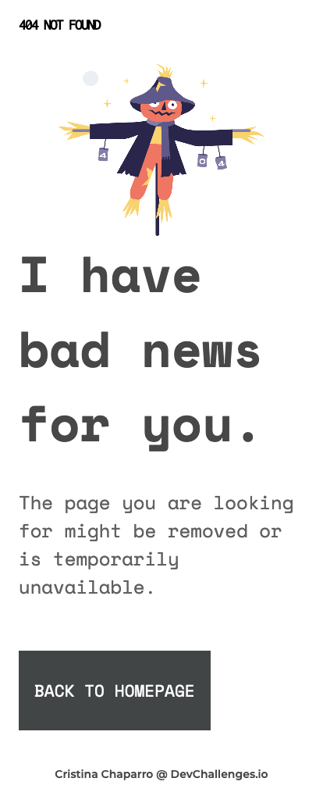

<!-- Please update value in the {}  -->

<h1 align="center">404-NOT-FOUND</h1>

   Solution for a challenge from  <a href="http://devchallenges.io" target="_blank">Devchallenges.io</a>.

  <h3>
    <a href="hhttps://github.com/nofsys/404-not-found">
      Solution
    </a>
     | 
    <a href="https://devchallenges.io/challenges/wBunSb7FPrIepJZAg0sY">
      Challenge
    </a>
  </h3>

<!-- TABLE OF CONTENTS -->

## Table of Contents

- [Overview](#overview)
  - [Built With](#built-with)
- [Features](#features)
- [Contact](#contact)

<!-- OVERVIEW -->

## Overview

Here you are my first solo project. It's the first one I face alone, without the help of an online course I can follow through.

It's simple, but it has helped me improve my use of the property flex and to realise that I have to practice more about media queries.

My biggest challenge here has been, precisely, creating a flexible design that adapted naturally to any screen size. It took me some time to figure how to keep elements where I wanted them to be.

### Built With

HMTL and CSS

## Features

This site was created as a submission to a [DevChallenges](https://devchallenges.io/challenges) challenge. The [challenge](https://devchallenges.io/challenges/wBunSb7FPrIepJZAg0sY) was to build a site to complete the given user stories.

## Contact

- GitHub [@nofsys](https://github.com/nofsys)
- Twitter [@nofsys](https://twitter.com/nofsys)
